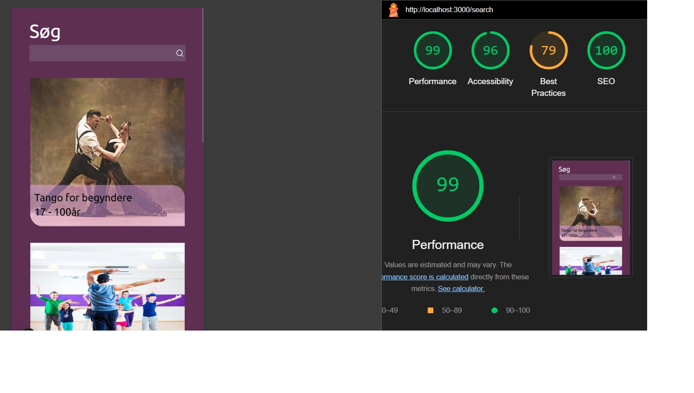

# **Dokumentation for "Landrup Dans"**

***Pernille Lang, WU11.***

***Github URL:*** https://github.com/CMK-WU11/svendepr-ve-euv-PernilleLang 

***API URL:*** http://localhost:4000/

***URL, til Landrup Dance:*** http://localhost:3001/

***Adgang, f.eks.:***   
Brugernavne & adgangskode:  
    | user1 | 1234 |  
    | user2 | 1234 |  
    | user3 | 1234 |  
    | user4 | 1234 |  
    | user5 | 1234 |  
    | user6 | 1234 |


# **Teknologi stack**
 ***Next.js*** Jeg har bugt Next.js, som er et React framework. Jeg har derfor alt det gode fra React, men Next.js er mere dynamisk, samt giver mig mulighed for nem fil og mappe routing. React ville også have været et godt bud, men med alle Next.js’s indbyggede features (som Images og Links tags, not-found.js og routes) så er Next.js bare lige dét bedre.   

***Tailwind CSS, samt https://tailwindcss.com/docs/installation*** Jeg har brugt Tailwind til styling, da dette giver en hurtigere styling og dermed er mere brugervenligt for programmøren. Tailwind er nemt og simpelt, og det gør at jeg f.eks. er fri for at bygge klasses i CSS og så fører dem ind i hver enkelt element, komponent og/eller route. Tailwind giver mig et bedre overblik, så jeg ikke skal bladrer igennem mange sider og huske en masse class og id navne.  

***React Icons (https://react-icons.github.io/react-icons/)*** React Icons er super nemt at anvende, biblioteket skal blot installeres også har jeg nem og hurtig adgang til et helt bibliotek af gratis ikoner. Jeg kunne også her have valgt Fontawesome, som jeg tidligere har benyttet, men React Icons har langt flere tilgengængelige ikoner. Hos Fontawesome går jeg tit forgæves og ikonerne er ikke altid gratis - hvilket er uhensmæssigt som programmør at bruge tid og energi på. 

***Zod, formvalidering (https://zod.dev/?id=installation)*** Jeg har hentet ZOD som bibliotek til validering af formularer, da dette er nemt at anvende og valideringen giver en mere simpel formvalidering og kode. Zod er forholdsvist nemt og giver en god validering, det gør koden mere DRY og simpel. Alternativet kunne f.eks. være at jeg skulle hardcode (lave min kode med Javascript) - igen spild af tig og energi!
 

# ***Tredjepartskode*** 
***Til animeret knap: https://www.geeksforgeeks.org/how-to-add-keyframes-to-a-tailwind-css-config-file/*** Siden her gav mig stor hjælp til at benytte keyframes til styling af min knap på forsiden. De fleste andre sider gav mig ikke så stor hjælp som denne her gjorde. 

***Til import af fonts: https://www.itzami.com/blog/how-to-add-a-google-font-to-your-gatsby-tailwind-project*** Jeg har benyttet denne side til stor inspration af hvordan jeg importer fonts til styling og benyttelse med projektet her. Jeg bladrede igennem flere sider, men denne her gav mig størst forståelse for det.


# ***Eksempel på noget kode fra min opgave, med noter***

***Et eksempel fra min kode*** Jeg har valgt denne kode til forklaring, i et eksempel, da jeg syntes det at fetche og mappe er interessant. Det har også været en udfordring for mig.  
Jeg bruger en asynkron funktion fordi jeg fetcher i min funktion. Det betyder at jeg skal håndtere sideeffekter, som i dette tilfælde er min API fetch. Jeg fetcher så mit API link (som betyder at hente data fra en ekstern server). En fetch er en funktion som henter information fra en API. Min const herefter (navndøbt classes) tager svaret og udskriver json. Herefter går jeg ned og mapper min nye viden i min jsx. At mappe betyder at tage et array og lave om til et nyt array. 
Nu bliver hver enkelt hold til en ClassCard komponent. Jeg giver hver ClassCard en key baseret på aktivtetsnavnet, så nu kan jeg derfor hente alle brugernes tilmeldte hold, og de printes alle ud.
Herudover dette har jeg også brugt metadata til at omdøbe titlen i browserens fane, samt hentet min navigation ind som en komponent. Selvfølgelig har jeg også stylet på det hele.

```javascript
export const metadata = { title: "Aktiviter" }

export default async function Activities() {

    {/* Fetch og map funktion er kopieret fra min terminsprøve opgave og tilpasset */ }

    const responseClasses = await fetch(
        "http://localhost:4000/api/v1/activities",
    )
    const classes = await responseClasses.json();

    return (
        <>
            <section className="h-screen w-screen bg-[#5E2E53] overflow-x-scroll">
                <h1 className="text-white text-[36px] pl-[1.3em] pt-[0.5em]">Aktiviteter</h1>
                {classes.map(element => (
                    <ClassCard classes={element} key={element.name} />
                ))}
            </section>
            <Navigation />
        </>
    )
}
```


# ***Argumentation for ændringer***
***Knap på forsiden*** Jeg har valgt at lave denne knap bouncende. Jeg syntes det gør siden mere aktiv og sjov, hvilket panser til dansetemaet. Det fanger brugerens opmærksomhed og signalerer at knappen kan (og skal) bruges. Særligt omkring opmærksomhed ved knappen så syntes jeg at dette mere brugervenligt for personer med synsnedsættelse.

***Resultater på søgefelt*** Jeg har valgt at lave metoden her om. I opgavebeskrivelsen står der "Listen over resultater vises kun, efter en bruger har skrevet noget i søgefeltet." Jeg finder det personligt mere dynamisk og brugervenligt at resultaterne vises løbende når man skriver i input feltet.

# ***Skalering af fremtiden***
***Fremtiden for mit projekt*** Mit projekt er lavet i mobilefirst, og derfor er det lige klar til at tilgå til at lave til iPad størrelse og fuld hjemmeside oplevelse. Brugerne skal også kunne til og framelde sig hold, man skal kunne tilmelde sig hold efter sin alder samt at kalenderknappen skal være et login ikon - indtil man er logget ind, så skal der være et kalender ikon istedet for. Herefter ville mit projekt nemt kunne udgives på Vercel, da jeg har lavet mit projekt i Next.js. Vercel er lavet af Next.js, og derfor er det lavet til at performe derefter - Derfor er det specifikt Vercl jeg nævner.
  

# ***Fremhævelse***
Accessibility og SEO, er noget jeg går op i, så derfor er det vigtigt for mig at fremhæve netop dette fra min opgave.
Lige præcist mit søgefelt har udfordret mig både kodemæssigt, men også omkring performance og accessibility. Jeg har forsøgt mig frem med flere forskellige farveskaler og forsøg. Teksten blev lavet hvid, så sort også tilbage til hvid. Herefter gennemgik jeg det samme med mit input felt. Som det ser ud nu, står det helt sikkert bedst - Men med plads til forbedringer, som jeg ikke havde tid til at gå dybere ind i under svendeprøven. Problemet er mere specifikt billederne da de ikke står helt skarpt i "ratio" (altså billede forhold / format), og derfor påvirker dette lighthouse testen "Best Practis". Alle mine sidder lægger generelt på 100% - eller lige under - i accesibility og SEO (Search Engine optimization). Hvilket jo er det jeg vil fremhæve. 
